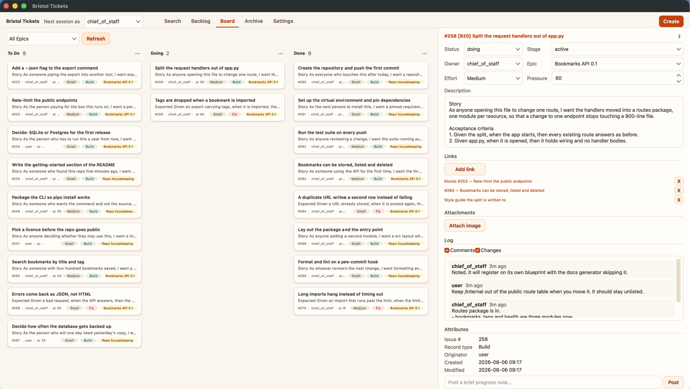

# Bristol

A Kanban board you share with AI agents, managing their work with tickets. It
runs under any AI application that can read and write a folder on your machine
and run commands in it.

You keep your work on a board of cards: to-do, doing, done. Open an agent
session pointed at this folder, say "continue," and the agent reads the board,
takes the top card in its queue, does the work on your real files, and writes
back what it did. Next time you open the board, the card has moved.

Bristol ships with some readymade agents, and you can ask the default agent to change them, make new ones, absorb agents you've already built.

You don't talk to your agents in the board - that stays in your AI app, though within your configured project it will begin to address you and work with you differently, with new powers.



## About me (optional)

Howdy. I'm Jack Hatchett, a career Product Manager with hobbies. I had an AI agent build this tool as a dashboard to help visualize my progress across multiple projects in a familiar card layout, but it's grown into what I think is a unique personal productivity tool.

There are many other apps in this space, but this one's free (plus AI costs), and where those chase scale, I'm chasing coherence on a personal scale. AI app design is usually about designing data sets and optimizing standard, procedural queries - this was designed to organize one individual's infinitely varied tasks into a personal procedural framework. If that doesn't make any sense, don't worry: the chatbot assures me it's the single greatest idea anyone's ever had.

Etymology: Bristol board is a type of heavy paper, named after the guy who invented it, and it's what those red double-roll tickets that everyone in the US has used for a raffle or coat check at some point is printed on. We haven't all used enterprise product management tools for decades, but perhaps those tickets are a shared experience? Bristol is also the name of a town in PA that's personally meaningful to me.

## Before you install

**macOS, and an agent host** — an AI application that loads per-project
instructions, reads and writes a folder you choose, and runs commands in it.
That is what lets an agent do anything here; without one you get a working
Kanban board and nothing else.

Bristol names no vendor in any file it runs on, and ships an entry file for each
host so it finds its way in on its own. It has been run on Cowork, a mode in the
Claude desktop app; any host meeting those three requirements should work.

The downloaded app brings its own Python. Running from source wants 3.10 or
later.

## Skills other people wrote

A **skill** is a folder holding one Markdown file that tells an agent how to do
one job. It is an open format, and people publish thousands of them free.
Bristol reads them where they already are: point one setting
(`skills.install_dir`, in your configuration) at a folder of skills you keep,
and every skill in it is listed the moment a session starts — nothing copied, no
install step. To get that you need only what Bristol needs anyway: a Mac, and an
AI application that can read your folder and run commands in it, such as the
Claude desktop app. You do not need Hermes, the program many of these skills
were written for, nor an account with it, nor any other tool they mention.

What crosses, and what does not:

- **A skill crosses.** A folder with a `SKILL.md` inside it loads, whoever
  wrote it and whatever tool they wrote it for.
- **A description of a role written for another tool crosses once converted.**
  These arrive as a single Markdown file whatever the tool calls them, and one
  command turns each into a skill.
- **The lines inside a skill that route work in another tool are ignored** —
  which model to use, which tools to allow. Your AI application decides both,
  and Bristol has no say in either.
- **A skill that expects a password, an API key or another tool's own features
  does nothing here.** Installing one says so, and leaves the choice to you.
- **The rest of another tool does not cross.** Its board, its runtime, its
  scheduler and its saved profiles are that tool's, and Bristol claims nothing
  about them. If you use Hermes, the claim is only that the skills you have load
  here.

Two things worth knowing before you point the setting at a folder you care
about. Nothing here reviews a downloaded skill for you — a session reads it and
decides, and `src/skills/importing-a-skill/SKILL.md` is how. And that same
folder is where Bristol puts anything you install afterwards, so it reads and
writes there rather than only reading.

## Install

1. **Download** `BristolTickets-<version>.zip` from
   [the releases page](https://github.com/JackHatchett/bristol-tickets/releases),
   unzip it, and drag Bristol Tickets to your Applications folder.
2. **Open it.** The app is unsigned, so macOS blocks the first launch: click
   Done, then **System Settings → Privacy & Security → Open Anyway**. Once,
   ever. [install.md](docs/install.md) has the exact wording.
3. **Answer setup.** It asks where Bristol should live (`~/Bristol` by
   default), what to call this installation, which agents you want, and
   optionally a notebook and a Zotero folder. Finish writes the whole system
   into that folder and opens the board on it.
4. **Point your agent host at that folder.** Most read `AGENTS.md` or
   `CLAUDE.md` there on their own; setup shows the line to paste for one that
   takes typed project instructions instead.

Updating is downloading the newer app and opening it. It refreshes the
machinery and leaves your board, your settings and your files alone.

### From source instead

```bash
git clone https://github.com/JackHatchett/bristol-tickets.git bristol_tickets
cd bristol_tickets
pip install -r requirements.txt
python3 src/tools/bristol/app.py
```

Same system, build step in your hands. [docs/install.md](docs/install.md)
covers the whole chain, including the three optional tools that need something
pip cannot install.

## Quickstart

```bash
python3 src/tools/bristol/app.py                           # open the board
python3 src/tools/bristol/make_release.py                  # build the downloadable app
python3 src/tools/config_tools/read_config.py active_agent # who the next session runs as
```

Then, in a session with your Bristol folder selected, say `continue`.

## Updating

Your data lives beside the machinery, not inside the app, so an update never
touches it.

**Running the downloaded app:** download the newer release and open it. It
brings `src/` and the docs in your Bristol folder up to that release and leaves
`config/` and `data/` as they are.

**Running from source** (`python3 src/tools/bristol/app.py`, or the launcher
`make_launcher.py` writes): `git pull` and relaunch. There is nothing to
rebuild.

**Cutting a new release:** `python3 src/tools/bristol/make_release.py`. Full
detail in [src/tools/bristol/BUILD_APP.md](src/tools/bristol/BUILD_APP.md).

## The two surfaces

Both act on the same database and the same configuration, and each sees the
other's changes on its next read.

- **Bristol Tickets** (`src/tools/bristol/`) — the desktop app. Read the board,
  create and edit cards, drag them between columns, attach links and images,
  with no agent involved.
- **The agent session** (`src/app.md`) — the agent reads `src/app.md`, resolves
  your config, takes on one agent identity, and works the board.

`src/tools/` holds the rest of the standalone utilities, each independently
runnable.

## Documentation

Start at [docs/index.md](docs/index.md).

- [install.md](docs/install.md) — the prerequisites, in the order they have to
  happen.
- [sessions.md](docs/sessions.md) — the loop you actually live in.
- [board.md](docs/board.md) — tabs, columns, cards, links, images, reports.
- [agents.md](docs/agents.md) — the shipped agents and what each needs.
- [configuration.md](docs/configuration.md) — every key and its default.
- [architecture.md](docs/architecture.md) — how the app, the database and the
  agent files fit together.

## Contributing

[CONTRIBUTING.md](CONTRIBUTING.md).

## License

MIT — see [LICENSE](LICENSE).

Bristol Tickets is drawn with Qt for Python (PySide6), under the LGPLv3. Running
from source installs it onto your own machine and nothing further attaches. A
distributed `BristolTickets.app` carries a compiled copy inside the bundle, so
the build ships
[ACKNOWLEDGEMENTS.md](src/tools/bristol/ACKNOWLEDGEMENTS.md) in its Resources,
naming the licence and how a recipient replaces the bundled libraries.
